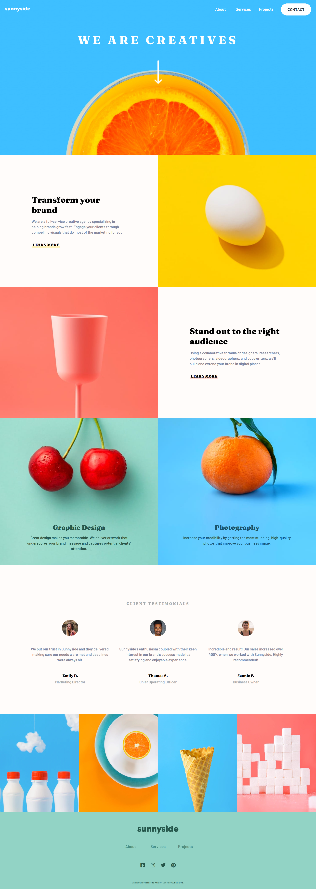

# Sunnyside agency landing page solution

This is a solution to the [Sunnyside agency landing page challenge on Frontend Mentor](https://www.frontendmentor.io/challenges/sunnyside-agency-landing-page-7yVs3B6ef). Frontend Mentor challenges help you improve your coding skills by building realistic projects.

## Table of contents

- [Overview](#overview)
  - [The challenge](#the-challenge)
  - [Screenshot](#screenshot)
  - [Links](#links)
- [My process](#my-process)
  - [Built with](#built-with)
  - [What I learned](#what-i-learned)
- [Author](#author)

## Overview

### The challenge

Users should be able to:

- View the optimal layout for the site depending on their device's screen size
- See hover states for all interactive elements on the page

### Screenshot

### Links

## My process

### Built with

- CSS custom properties
- Flexbox
- CSS Grid
- Block Element Modifier (BEM)

### What I learned :

This was one of my projects completed as a Frontend Mentor challenge, using HTML and CSS, so I already had some previous experience. However, I continued to learn a lot while working on this page, from refining my CSS skills to ensuring that the design was responsive and visually appealing.

Throughout the project, I faced some challenges, especially when implementing hover states for the interactive elements. Through practice, I managed to handle these states effectively, which significantly improved the user experience.

It was also rewarding to work on responsive design, ensuring that the page adapted perfectly to different screen sizes. Seeing how everything fit together in the end was very satisfying. This process has been enriching, and I am excited to keep learning in future projects.

## Author

- Website - [IgnaciioDev](https://ignaciiodev.github.io/portfolio2024/) 
- Github - [IgnaciioDev](https://github.com/IgnaciioDev) 
- LinkedIn - [IgnaciioDev](https://www.linkedin.com/in/ignaciodev/) 
